# 安路FPGA开发板
##  AST收发--信号完整性验证
> 此工程结合之前的接收模块，发送模块，数字输出模块，通过测试数据进行板间通信，后续加入LED显示核EEPROM
### 1、AST通信模块(第一代软核——资源占用较大，不适用)：  
板间收发正常，可正确接收16byte数据  
发送端led1亮表示发送正常  
接收端led2亮表示接收完成校验正确  
### 2、数字输出模块： 
EEPROM和AST两路数据输入   
上电后，没有数据流过，输出eeprom初始化给的数据，显示正常状态  
如果有数据流过，则输出该数据后16位，显示输出状态  
如果上电等待2s内无数据输入，显示初始化失败，需要重新激活eeprom  

# p7_8
同时例化两个一代软核遇到资源不足问题，打算通过优化代码解决  
1、将ram改用为bram；  
2、减少reg位数，避免未用到的reg没有优化掉(用修改后的ip核资源足够，等待单独IP核测试)  

---
# p7_9
IP核测试：测试有问题，用回原硬核 在数据接收判断作修改  
硬核板间通信：
1、发送端发出数据，接受端接收正常，接收端处理数据有问题，(计划在接收端接收数据后增加一个寄存信号，只保存有效数据)  
2、返回给发送端时，发送端接收有问题。待解决。。。(已解决，由于传输线不等长的原因)  

---
# p7_10
对于接收到的数据进行有效位寄存，增加一个数据寄存模块（无效）；  
针对接收到的数据进行解析Debug 发现接收数据后处理直至发送出去周期大约至少需要50   
**注意**：开始发送一次数据需要间隔50个周期再次发送，即2us发一次，否则会出现接收数据覆盖。  
通过计算数据处理周期  
T_recv+T_Com+T_app+T_Arbit+T_trans = 19(数据处理有效位为17bit)+1+1+1+18 =40 cycle  
理论上不低于40个发送周期  
问题：后模块可以正常接收前模块是数据并正常处理为返回数据，但是返回给前模块收到的有问题  
原因：数据传输线（双绞线）不等长  
解决方案：换等长传输线  
## 到此为止AST收发--信号完整性验证通过！  
## AST收发--信号正确性验证 
### AST通信功能验证：
实验步骤：两块开发板烧入同一个程序，并用Chipwatcher拉出要观察的前从机发送数据和接收数据、后从机接收数据和返回数据。  
实验现象：Chipwatcher观察收发数据  
1、读第一个和第二个从机的数据，地址从0开始读64个有效bit (由于没有找到对应设备，所以直接返回原值)
前从机发送：AA 0003 0000 0 000 40 01 23 45 67 89 ab cd ef b6  
后从机接收：同前从机    
后从机返回： AA 0003 0001 0 000 40 01 23 45 67 89 ab cd ef 28 (未找到设备) 
            AA 0003 0001 0 000 40 01 00 00 00 00 00 00 00 CC (找到设备并读取)  
发送端：   
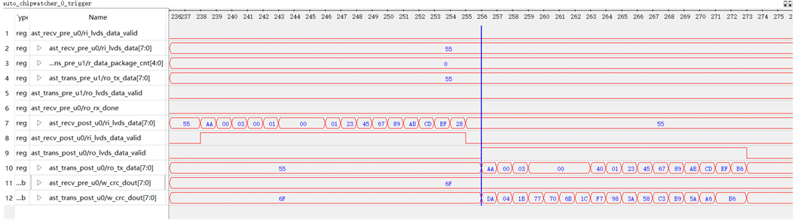  
接收端：  
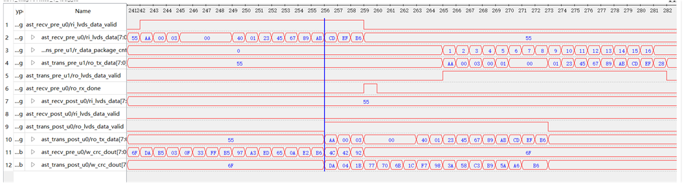  
前从机接收：同后从机   
2、自动编号功能  
3、写数据功能  
4、修改设备ID功能  
5、带电插拔  
### DO输出功能验证(附带LED显示功能)：
EEPROM给初值暂定为0 有效数据位为0
实验现象：  
前从机按下触发开关，出现ERROR的led状态显示，说明eeprom初始化失败，前从机的前面没有输入进来；
前从机按下触发开关，出现NORMAL的led状态显示保持，说明eeprom初始化成功，前从机的前面没有输入进来  
后从机按下触发开关，出现OUT 的led状态显示，说明前从机数据进入，并在初始化2s内收到。  

### RAM读写功能细节(APP层)：
1、考虑用多个RAM对数据进行读写  
首先考虑64bit 数据读写，用Depth=64 Width=1的ram，for循环并行读写(1cycle)  
|读：根据ADDR NUM 从ADDR向后读NUM个数 |写：根据ADDR NUM 从ADDR向后写NUM个数  |
|:--------------------------|:-------------------|
|从地址start_addr开始读取N位数据             | 假设我们要从地址start_addr开始写入64位数据data_64    |
|reg [N-1:0] read_data;                    |   for (int i = 0; i < 64; i = i + 1) begin           |   
|for (int i = 0; i < N; i = i + 1) begin   |    ram[start_addr + i] = data_64[i]; // 逐位写入    |
|    read_data[i] = ram[start_addr + i];   |    end       |  |
|end                                       |    

理论上可以，但实际ram无法在同一时钟进行超过2次以上的访问 
2、考虑用一个64位的reg进行读写，reg = {reg[63:addr+num],i_data[addr+num:addr+1],reg[addr:0]}。但是在物理上无法实现     
3、考虑例化8个位宽为1深度为8的ram，同步时钟进行访问，最少需要8个cycle可以完全访问
4、计划使用状态机，牺牲时钟，后面重新计算时间裕量  

---
# p7_11  AST收发
APP使用状态机进行数据处理，读写64bit数据最少需要时间为108个cycle (这里假定128个周期发一次)  
读写数据功能**测试**  (正常)：
实验步骤：两块开发板烧入同一个程序，并用Chipwatcher拉出要观察的前从机发送数据和接收数据、后从机接收数据和返回数据。  
实验现象：Chipwatcher观察收发数据  
1、发送一个写数据指令，隔128个cycle再发送一个读指令读对应从机的数据  
前从机发送：AA 0003 0000 1 000 08 00 00 00 00 00 00 00 ff f4 (0~127个周期写)  
AA 0003 0000 0 000 08 00 00 00 00 00 00 00 00 40 (128~256个周期读)  
后从机接收：同前从机    
后从机返回：AA 0003 0001 1 000 08 00 00 00 00 00 00 00 ff 3f (0~127个周期写)  
AA 0003 0001 0 000 08 00 00 00 00 00 00 00 ff 3e (128~256个周期读)  
前从机接收：同后从机  
> 明天完成设备ID读写功能测试与数字输出模块的完善

---
# p7_12  
### 自动编号功能**测试**  (正常)：  
实验步骤：两块开发板烧入同一个程序，并用Chipwatcher拉出要观察的前从机发送数据和接收数据、后从机接收数据和返回数据。  
实验现象：Chipwatcher观察收发数据  
1、发送一个自动编号指令，隔128个cycle再发送一个读指令读对应从机的数据
前从机发送：AA 0000 0000 2 000 00 00 00 00 00 00 00 00 00 8c (256~512个周期)  
后从机接收：同前从机    
后从机返回：AA 0000 0001 2 000 00 00 00 00 00 00 00 00 01 42  
前从机接收：同后从机   
#### 发送端：  
>TX端发送写指令，从00开始往后写8个1(ff)的数据  
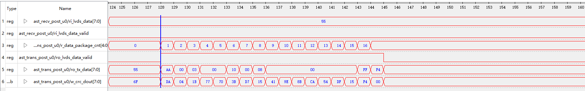
>TX端返回写完的指令反馈  

>TX端发送读指令，从00开始往后读8个的数据  
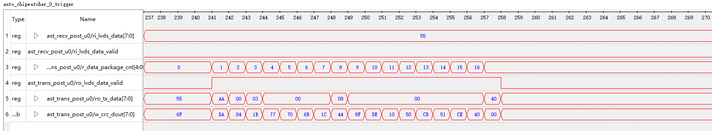
>TX端返回读回来的数据  
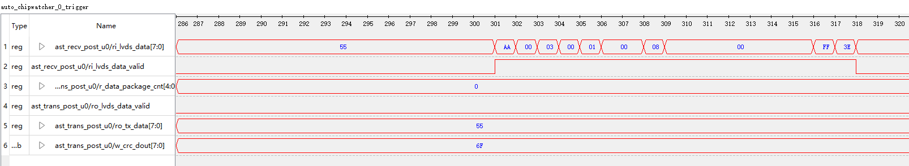
>TX端发送自动编号指令  
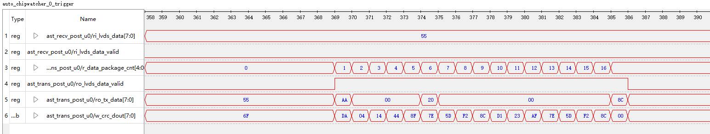
>TX端返回自动编号完的指令反馈，其中数据位代表了对TX端往后多少个设备进行编号
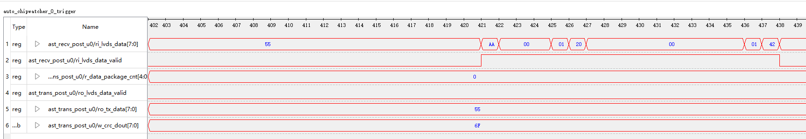
#### 接收端(重点关注握手信号和数据处理周期)：  
>RX端接收到写数据指令并进行数据处理  
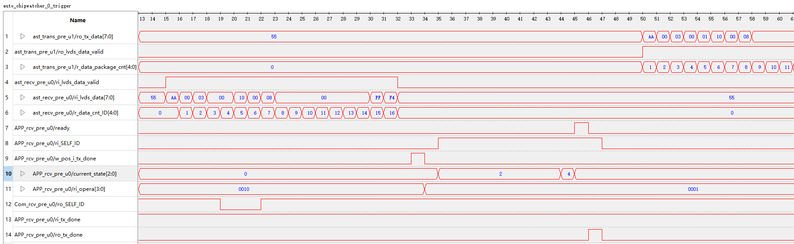
> RX端接收到读数据指令并进行数据处理  
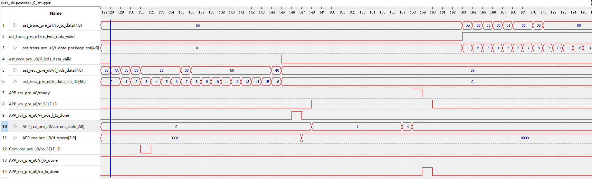
> RX端接收到自动编号指令并进行数据处理  
  

| 功能 | 进度 | 说明 |                                              
|:----|:----:|:------:|                           
| 写数据 | &#x2705; | 任务已完成 |                      
| 读数据 | &#x2705; | 任务已完成 |                   
| 自动编号 | &#x2705; | 任务已完成 |              
| 修改设备ID | &#x2705; | 任务已完成 |                      
| 带电插拔 | &#x1f504; | &#x26a0;&#xfe0f;需要注意 |                  

## 到此为止AST收发--信号正确性验证通过！  

数字输出模块完善：  
|接口端|收发内容1(写A5)|收发内容2(读a5)|
|:--|:--|:--|
| 前从机发送|AA 0000 0000 1 000 00 00 00 00 00 00 00 00 a5 94  |AA 0000 0000 0 000 00 00 00 00 00 00 00 00 a5 40  |
| 后从机接收|同上前从机                                         |同上前从机   |
| 后从机返回|AA 0000 0001 1 000 00 00 00 00 00 00 00 00 a5 5f  |AA 0000 0001 0 000 00 00 00 00 00 00 00 00 05 9a  |
| 前从机接收|同上后从机                                         |同上后从机   |                

当ram数据使能位为高或者ast端数据有效位不为0，led显示在输出状态，当下一个通知发过来重新进行判断。(仅限从机测试)
当ram数据使能位为低或者ast端数据有效位为0，led显示在报错状态，  
经过测试发现，仅限于前端有数据输入的情况才会正常输出，如果本机是主机，则DO模块不工作。
## 到此为止DO输出--验证通过！

--- 
## LED_Dispay  
模块比较简单，设计已完成，等待测试，实际效果需要根据外部电路引脚接出。  
|模块|  输入 |输出|
|:--|:--|:--|
|主机|(需要单独加一个led显示)   |o_RUN/o_ERROR|
|从机|w_sub_code[63:0]/w_state   |o_subcode_data[15:0]/o_RUN/o_ERROR|

> 接下来准备主机相关接口的完善 

---
# p7_14   LED_Dispay
LED_Display模块需要分主机/从机/末端
纠正1：LED_Display 模块输入ERROR情况来自不同模块的报错信息
|主机：ERROR|说明|
|:--|:--|
|MCU通讯  |                                                 | 
|后模块通讯  |未检测到发送校验完成的crc脉冲信号                | 

|从机：ERROR|说明|
|:--|:--|
|EEPROM      |输出设备ID值为16'h00(未初始化，一般自动编号胡的设备ID不为0)   | 
|模块通讯    |未检测到接收校验完成的crc脉冲信号                            | 
|数字输出    |2s内未检测到数据有效信号进入                                |

|eeprom|state |code|说明|
|:--|:--|:--|:--|
|  8b'00_000000 |64h'xxxxxxxx	|未初始化				    |
|  8b'00_000001 |64h'xxxxxxxx	|正常运行中				    |
|  8b'10_000001 |64h'xxxxxxxx	|Warninig：EEPROM 无法通讯	|

|通讯模块|state |code|说明|
|:--|:--|:--|:--|
|  1	|8b'00_000000 |	64h'xxxxxxxx	|未初始化                        |
|  2	|8b'00_000001 |	64h'xxxxxxxx	|正常运行中                          |
|  3	|8b'11_000001 |	64h'xxxxxxxx	|ERROR：子设备ID不在1~16之间|
|  4	|8b'11_000002 |	64h'00000001	|ERROR：内部总线异常，前模块通讯异常。|   
|  5	|8b'11_000002 | 64h'00000002	|ERROR：内部总线异常，后模块通讯异常。|
> 问题：如何判断内部总线异常？

|DO输出状态|state |code|说明|
|:--|:--|:--|:--|
|  1	| 8b'00_000000	| 64h'xxxxxxxx	|未初始化			        |
|  2	| 8b'00_000001	| 64h'xxxxxxxx	|正常运行中		            |	
|  4	| 8b'01_000001	| 64h'DO状态	|正常： subcode为DO输出值    |
|  3	| 8b'11_000001	| 64h'xxxxxxxx	|ERROR：初始化失败          |
 
纠正2：APP模块 判断是否为本设备时序做了修改
问题：为本设备时数据可以正常处理并返回。非本设备时无法返回数据
解决方案：设置触发信号，在i_tx_done 上升沿数据进入，在下降沿进入是ID_true信号，并在下一拍判断是否是进行数据处理还是直接流出返回

# p7_15

关于led显示，需要考虑两个问题：  
1、什么时候更新状态，即数据什么时候进来 :下次数据进来校验完成更新   
2、如何在数据进入后让灯保持显示： 用crc信号作为指示信号即可使状态保持  
> 说明：数据更新时间为下一次指令进来  
### 下面为最新状态表，有些状态并在一起
|eeprom| | |
|:--|:--|:--|
|state |code |说明| 
| 8'b00_000000	|64'hxxxxxxxx| 未初始化				    |
| 8'b00_000001	|64'hxxxxxxxx| 初始化成功				| 
| 8'b01_000001	|64'hxxxxxxxx| 一般运行				    |
| 8'b11_000001	|64'hxxxxxxxx| Error：初始化失败		| 		
| 8'b10_000001	|64'hxxxxxxxx| Warninig：EEPROM 无法通讯 | 

|通讯模块|||
|:--|:--|:--|
|state |code |说明| 
| 8'b00_000000|64'hxxxxxxxx	| 未初始化 |
| 8'b00_000001|64'hxxxxxxxx	| 初始化成功|
| 8'b01_000001|64'hxxxxxxxx	| 一般运行|
| 8'b11_000001|64'hxxxxxxxx	| Error： 初始化失败|
| 8'b10_000001|64'hxxxxxxxx	| Warning： 子设备ID不在1~16之间|
| 8'b11_000010|64'h00000001	| ERROR： 内部总线异常，前模块通讯异常。|
| 	           |64'h00000002	| ERROR： 内部总线异常，后模块通讯异常。|

|DO输出状态 |||
|:--|:--|:--|
|state |code |说明| 
| 8'b00_000000 |	64'hxxxxxxxx	|未初始化			            |
| 8'b00_000001 |	64'hxxxxxxxx	|初始化成功		                |
| 8'b01_000001 |	64'hDO状态	     |一般运行 ： subcode为DO输出值	 |  		
| 8'b11_000001 |	64'hxxxxxxxx	|Error：初始化失败			    |

说明：数据更新时间为，下一次指令进来  
实际上 i_com_subcode只需要前端的crc检验正确信号、后端连接信号与crc校验正确信号即可  
i_com_subcode:{pre_crc_true,Pin_next_valid,post_crc_true}  
pre_crc_true : 0 表示前通讯模块内部报错 1 表示正常运行  
Pin_next_valid: 0 表示后端未连接 1表示有连接   
post_next_true : 0 表示后通讯模块内部报错 1 表示正常运行  
所以一共六种情况(只有全部是1的情况为正常运行)：  
{000}前模块报错后模块未连接 (ERROR 末端)  
{010}前模块报错后模块也报错 (NOT INITIAL )  
{011}前模块报错后模块正常   (作为主机NORMAL  作为从机前模块ERROR)    
{100}前模块正常后模块未连接 (作为末端NORMAL  )  
{110}前模块正常后模块报错   (ERROR    )  
{111}前模块正常后模块正常   (NORMAL   )   
 c前后以crc_true信号为判断指示信号，crc校验为true则拉高，直到下一次判断，即只有两个cycle的空置(80nsEEROR亮，可忽略)  
### 后面工程开始由两个工程文件，TX作为主机模块编写 RX作为通用从机模块编写 
区别1:LED显示不同 主机显示状态判断由LED状态、MCU状态、通讯模块(后端)决定；
                 从机显示状态判断由LED状态、EEPROM状态、通讯模块、数字输出决定     
区别2:主机没有数字输出和EEPROM，增加了UART与MCU的通讯 

>后面工作：
        1、主机模块的裁剪、引出相关接口为后续IIC和UART做准备；
        2、区别主机和从机的LED显示；
        3、根据EEPROM芯片手册时序图设计电路逻辑和波形。

# P7_17  EEPROM
## IIC读写EERPROM芯片验证 (波形原理图可以参照文件 i2c_top.vsdx)  
使用芯片：AT24C512  电平：3.3V  主时钟：25M  
IIC驱动时钟：500K, 四分频f_scl = 125k (<=1M)   
实验步骤：先写64个byte的数据，数据内容与地址相同；写完拉高wr，隔10ms 将64个byte的数据循环读取  
实验现象： 参考文件 ./IIC_eeprom/i2c_top.vsdx 页4   
> iic读写EEPROM验证正确  

# P7_18  
关于EEPROM读写模块编写的几个问题：  
1、什么时候写入数据，何时读数据。  
当保存的数据(前后对比不一样)有变化时，写入EEPROM内; 每次上电将数据读给fpga  
2、EEPROM写一个byte，时钟为500K，需要周期为160cycle(320us),  
通讯模块输出的code值周期为发送报文周期(收发64bit 大约120个cycle，近5us)，  
是否有必要做到依次擦写存储  

# P7_19
关于读写EEPROM的流程的一些纠正  
1、本模块设计上电后20ms进行一次的**EEPROM读操作**RD，  
将读出的数据进行校验，校验成功则同时赋值给NEW区和OLD区  
校验失败则把0赋给NEW区和OLD区，同时进行**EEPROM写0操作**WR，  
一般来说校验都成功。至此完成初始化操作   
2、本模块设计在完成初始化操作之后，进入等待状态WAIT，  
等待的过程中，模块会进行定时1s将NEW区的数据存给BUFFER区  
存完的同时让BUFFER和OLD的数据对比，如果不同则将BUFFER区的数据存给OLD，  
同时OLD区进行一次**EEPROM写操作**。至此完成一次数据保存操作    

总结：EEPROM只会读一次，之后都是修改操作触发写
问题：CRC校验考虑用CRC32做，一次校验128个byte 后续打算是否进行页写 

# P7_22  
完成读初始化失败重新写0操作 

# P7_23 
目前为止，连续读写信号完整性验证完成。(在业务流程的基础上进行验证) 
实验步骤：程序上电后读一次地址0~120的数据，并同时开始校验，读到地址110数据后完成校验，地址120为校验位  
将两者进行对比，如果相同则进入等待状态，否则进入写0状态，写完0后进入等待状态。在等待状态时，NEW会接收数据  
BUFFER每1s取一次NEW的数据与OLD进行比较，如果不同则进入写数据状态，一样则继续等待下一秒的数据对比  
实验现象：上电后进行调试，开启触发开关后按一次复位(由于只读一次，所以上电后会立刻读完写完，需要重新复位 捕获信号)   
通过观察IIC_rw的状态1开始后i2c_drive的状态13读状态，连续看前一两个和最后一两个，对比最后校验值是否一致。若一致则表示信号完整接收并校验成功  
若校验值不对，则自动跳入状态4写零状态重新写0。   
## 到此为止EEPROM连续读写--数据完整性验证通过！
> 遇到问题：在缓存区进行判断时BUFFER和OLD在相同的数据进来时diff拉高，计划调整缓冲区时序即可   

# P7_24
相同的数据进来时diff拉高原因：diff拉高是因为BUFFER区和OLD区异或判断为1，  
检查发现是对读EEPROM内的数据进行解析时未非脉冲触发寄存，导致寄存的72bit数据  
一直在被覆盖，以此给到OLD和NEW的值是连续的9个EF。  
解决方法：给解析数据的判断条件添加ri_i2c_end触发脉冲
最后的模块测试结果：  
上电后下载程序，按下模拟上电开关，程序启动，读eeprom数据并校验，成功校验即初始化成功，进入等待状态，APP发出修改初值DO或者ID，收到进行对比  
与之前的一样则继续等待，否则就写入EEPROM，然后继续等待。  
(一般情况都校验成功，失败可能的原因EEPROM内部损坏，或者在写EEPROM时强制断电)  
时序分析：上电后10ms开始拉高rw再过10ms读数据，再10ms内(8.888ms写2us*(124+36*120)，读大约要9ms)读完并处于等待状态  
IIC控制模块资源使用：lut 878 19.6%
## 到此为止EEPROM模块--验证通过！

结合通讯模块中的Comm模块和APP模块，判断信号的何时进入  
联合各个模块综合完成  出现资源不足问题 Design's mslice number = 1130, exceeds the limit 1120.  
解决方法：process->properties->Read Design->infer_add，调整该属性的开关 具体原因需要分析log文件    
计划后面开始编写测试文档与程序  。。。  

# P7_25 主从功能测试 
## 主从功能测试 
修改主机发送的报文内容，观察从机DO的灯状态、运行状态灯、从机EEPROM的数据是否改写、主机是否正确回收到数据。    
### 所需观察的信号  
主机: 发送数据，计数器，有效使能；接收数据，计数器，有效使能；i_MCU_state    ; i_comm_state ;  
从机: 接收数据，计数器，有效使能；发送数据，计数器，有效使能；i_EEPROM_state ; i_comm_state ; i_DO_state ;   
主机状态信号灯 ： 正常情况：mcu P_S_NORMAL comm P_S_RUN   
从机状态信号灯 ：正常情况：eeprom P_S_RUN comm P_S_RUN DO P_S_NORMAL/P_S_RUN   
|状态|主机|从机|
|--|:--|:--|
|0.5s闪烁|MCU警报|EEPROM警报/DO输出报错|
|2s闪烁|通讯模块报错(后模块未连接/后模块通信失败)|通讯模块报错(前模块未连接)|  
|常亮|正常运行|正常运行|   

发送报文约束：  
写数据输入(地址+写数据个数)应在有效地址范围0~63，如果超出63会导致改写EEPROM内初值
|功能|写数据|读数据|自动编号|修改地址|修改初值|
|--|--|--|--|--|--|
|地址|0~3F|0~3F|00|200|40~7F|
|操作码|0001|0000|0010|0001|0001|
|数据个数|0~3F|0~3F|X|1|0~63|
### 自动编号测试 &#x2705; 
实验目的：检验自动编号功能是否正确，是否可以正确读写EEPROM
实验步骤：发送自动编号操作码 0010 地址 0x200 断电后上电观察EEPROM读初值是否正确 回收主机接收是否正确  
实验现象：主机发送完数据并回收到数据，RUN灯常亮；从机由于时自动编号，会2s闪一次，停在Wanning状态(可优化)
从机完成后用读EEPROM程序进行一次连续读调试，观察121个字节的内容，重点看第1个字节的内容修改为01则表示正确自动编号  
(可以提前计算校验值，通过查看最后校验值判断是否成功自动编号) 校验值为3A   
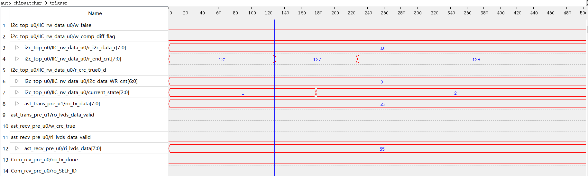
### 修改ID测试 &#x2705;   
实验目的：检验修改设备ID功能是否正确
实验步骤：ID的存储单元位宽为8bit 发送写操作码 0001 地址 0x200 写个数 01 数据 所需修改ID号0x10   
        断电后上电观察EEPROM读初值是否正确 回收主机接收是否正确  
实验现象：看第1个字节的内容修改为10则表示修改成功 计算校验值为A0  
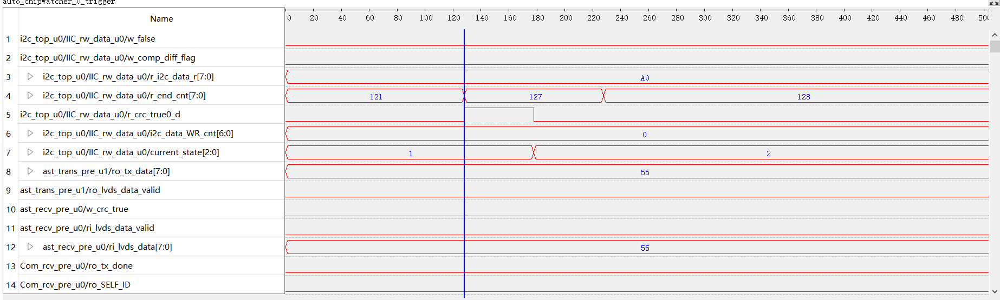  
>小问题：eeprom不能使用tx_done信号作为触发将数据寄存，而是要用o_decode_flag信号   
因为只有自动编码、修改ID、修改初值时才需要写eeprom   
### 写数据测试 &#x2705;    
实验目的：检验修改设备写数据功能是否正确，DO是否可以实现有效位覆盖输出的功能  
实验步骤：发送写操作码 0001 地址 0x000 写位数 0F 数据 0x11AA 观察DO输出指示灯是否正确 回收主机接收是否正确   
         再发一条写数据报文 地址位数相同 数据为 0xEE55 (理论上指示灯由按间隔亮变成全亮)  
实验现象：观察到返回数据正常，主机和从机RUN灯常亮，从机DO输出显示为11aa状态(低电平有效)   
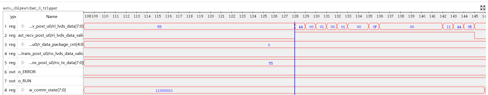   
### 读数据测试 &#x2705;   
实验目的：检验修改设备读数据功能是否正确，主机是否能够收到从机的状态     
实验步骤：发送读操作码 0000 地址 0x000 写位数 0F 数据 0x  观察DO输出指示灯是否正确 回收主机接收是否正确    
实验现象：观察到回收的数据正常 主机和从机显示RUN状态灯常亮 DO显示灯不变化  
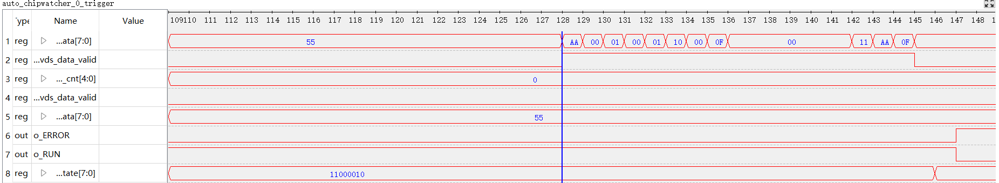

# P7_26 
完成功能测试  

# P7_28  
问题：修改初值和ID号时独立的两条报文，即在EEPROM中，修改其中之一另一个保持不变  
现状：修改ID号初值清零。修改初值ID号清零  
解决方法：  
APP端：用两个触发信号分别表示ID有变动和初值有变动  输出给IIC端   
IIC端：用两个触发信号对EEPROM写数据进行控制，修改ID或者自动编号时只对ID号部分操作，修改初值只对初值部分操作   
结果：修改完成后可以单独对EEPROM的ID或者初值进行修改    
## 到此为止主机与从机的功能测试验证通过！  
### 主机使用资源 
- lut：使用了645个查找表，总共有4480个可用查找表，利用率为14.40%。  
- reg：使用了531个寄存器，总共有4480个可用寄存器，利用率为11.85%。  
- le：786  
- lut only：仅使用查找表的逻辑单元数量为255，占总逻辑单元数786的32.44%。  
- reg only：仅使用寄存器的逻辑单元数量为141，占总逻辑单元数的17.94%。  
- lut&reg：同时使用查找表和寄存器的逻辑单元数量为390，占总逻辑单元数的49.62%。  
- dsp：数字信号处理块的使用数量为0，总共有15个可用DSP块，利用率为0.00%。  
- bram：  
- bram9k：9Kb大小的块RAM使用数量为0。  
- fifo9k：9Kb大小的FIFO使用数量为0。  
- bram32k：32Kb大小的块RAM使用了3个，总共有6个可用，利用率为50.00%。  
- bram128k：128Kb大小的块RAM使用数量为0。  
- bram256k：256Kb大小的块RAM使用数量为0。  
- pad：焊盘（用于芯片引脚连接）使用了14个，总共有202个可用，利用率为6.93%。  
- pll：锁相环使用了1个，总共有1个可用，利用率为100.00%。  
- gclk：全局时钟资源使用了2个，总共有16个可用，利用率为12.50%。  
### 从机使用资源(加上chipwatcher) 
- lut：使用了3599个查找表，总共有4480个可用查找表，利用率为80.33%。  
- reg：使用了3459个寄存器，总共有4480个可用寄存器，利用率为77.21%。  
- le：3943  
- lut only：仅使用查找表的逻辑单元数量为484，占总逻辑单元数3943的12.27%。  
- reg only：仅使用寄存器的逻辑单元数量为344，占总逻辑单元数的8.72%。  
- lut&reg：同时使用查找表和寄存器的逻辑单元数量为3115，占总逻辑单元数的79%。  
- dsp：数字信号处理块的使用数量为0，总共有15个可用DSP块，利用率为0.00%。  
- bram：  
- bram9k：9Kb大小的块RAM使用数量为0。  
- fifo9k：9Kb大小的FIFO使用数量为0。  
- bram32k：32Kb大小的块RAM使用了6个，总共有6个可用，利用率为100%。  
- bram128k：128Kb大小的块RAM使用数量为0。  
- bram256k：256Kb大小的块RAM使用数量为0。  
- pad：焊盘（用于芯片引脚连接）使用了35个，总共有202个可用，利用率为17.33%。  
- pll：锁相环使用了1个，总共有1个可用，利用率为100.00%。  
- gclk：全局时钟资源使用了4个，总共有16个可用，利用率为25%。 

> 另外，关于主机的LED显示和MCU通信有待完善

# P7_29 综合测试  
1、针对主从间通信的编写连续多次收发代码进行综合测试，检查数据完整性，led显示状态(DO输出)，eeprom读写内容。  
2、根据ADC芯片设计SPI控制模块。
综合测试  
读数据1：从地址0读16位数据       读数据2：从40读16位数据(新增)   
写数据1：从地址0写8位数据0xAAAA  写数据2：从0写16位数据0xEE55     
写数据3：从8写8位数据0xAAFF      写数据4：从40写16位数据0x1111     
#### 测试1&#x2705;：上电 --> 自动编号 --> 修改初值 --> 写数据 --> 读数据；
#### 测试2&#x2705;：上电 --> 自动编号 --> 修改初值 --> 读数据 --> 写数据；  
> 新增：仿造写数据流程，完善读数据的完整性，增加读初值部分
#### 一主一从测试例程消耗时间
>上电初始化：30ms(EEPROM初始化) + 128cycle(APP初始化)    
>自动编号(64bit data)：开始发送至完全接收 85cycle*40ns  
>修改初值(64bit data)：开始发送至完全接收 67cycle*40ns  
>0写8bit(64bit data)：开始发送至完全接收 76cycle*40ns  
>8写8bit(64bit data)：开始发送至完全接收 75cycle*40ns  
>8读16bit(64bit data)：开始发送至完全接收 74cycle*40ns 2.9us 

# P7_31 ADC的SPI通信  
关于ADC 的SPI通信  
问题1、通信时钟理论上最高10M，实际在2M可达到时钟波形稳定。
问题2、物理电路上片选信号实际连接一直拉低，软件上利用片选信号控制数据发送接收

# P8_4
### FPGA控制SPI
SPI工作时钟要求，芯片规定SPI时钟<10Mhz,经过FPGA输出的多个频点验证,500K/1.5M/4.5M/5.5M可用
#### ADC相关配置:
寄存器配置：  
硬件复位         P_HARD_RESET  =   32'h00_A5_FF_5A  
寄存器复位       P_SOFT_RESET  =   32'h80_00_00_00  
配置系统寄存器0  P_SYS_CONF0   =   32'h01_00_00_00  开启片选
配置系统寄存器1  P_SYS_CONF1   =   32'h00_00_00_80  使能内部2.5V基准电压
配置转换寄存器0  P_CONV_CONF0  =   32'h80_41_80_32  
80：转换使能   
41：接收数据sdo拉低频率为400Hz即2.5ms接收一次，三阶滤波器即转换指令发送完直到接收的周期约为9ms； 
80：选择基准电压REF2  
32：外界PIN脚   
硬件配置：  
硬件cs接地即可 主时钟500K  
#### ADC初始化
按键模拟设备发出adc初始化信号，按键按下 800个cycle后送信-->  
P_HARD_RESET硬件复位 --> 读一次SYS_CONF0 --(bit15==1)-->  
写一次SYSCONF0开启片选--> 读一次SYS_CONF0 --(bit[31:15]==0100)-->  
写一次SYS_CONF1使能REF2--> 读一次SYS_CONF1 --(bit一致)-->   
写一次CONV_CONF0 --> 读一次CONV_CONF0 --(bit一致)--> 转换  
#### ADC转换读取  
发送 8‘h83 等待miso拉低 -->   
(等待2s后不拉低则再次初始化)大约9ms拉低-->   
检测到拉低则发送8'h42并读取ADC24bit数据 -->  
转化为电压数据接收下一个数据(大约2.5ms再次拉低)   
#### ADC转换为电压  
adc系数: ((2.5V * 1000mV/V) / 0x7FFFFF )* 2^16 * 2^n (取小数点后n位，这里取3)   
// COEFFICIENT_MV = (2500 /  8388607 )* 2^16 * 2^n ≈ 19531.2498  
   COEFFICIENT_MV = 32'h00004C4B           ;  
实际电压=['d(w_user_convt_data * COEFFICIENT_MV) >> 16]/1000    

(资源使用如下)  
|Instance        |Module     |le     |lut     |ripple  |seq     |bram    |dsp   |
|----------------|-----------|-------|--------|--------|--------|--------|--------|
|top             |spi_top    |744    |627     |86      |452     |0       |2       |
|  SYSTEM_CLK_U0 |SYSTEM_CLK |0      |0       |0       |0       |0       |0       |
|  spi_drive_u0  |spi_drive  |254    |194     |43      |143     |0       |0       |
|  spi_test_u0   |spi_test   |427    |390     |37      |251     |0       |0       |

# P8_7
针对于ADC资源使用过高，对工程代码进行适当修剪   
实际与主工程合并需要将调试部分电路删除，删除后工程可节约一般的lut资源 #lut 512   out of   4480   11.43%    

>下面对UART通信作DEMO的创建，为后期MUC通信作准备  
#  P8_8  UART通信
UART通信仿真：
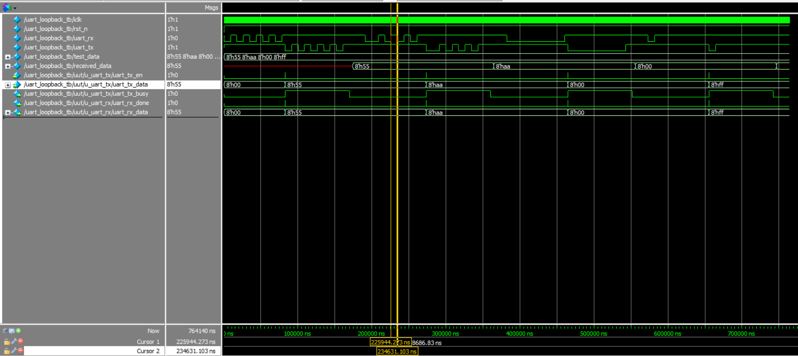  
主时钟为50Mhz，发送模式：起始位(下降沿)+8bit数据(由低到高)+结束(上升沿)  波特率 115200   
单bit发送时间：1000_000_000/115200 = 8680 ns   

UART实际上版测试：  
步骤1、将RX和TX短接，上位机可以接收到回环数据。  
步骤2、将RX和TX接上FPGA，外加一个GND，上位机可以接收到回环数据，示波器显示波形正常，一个bit8.680us的时钟周期   
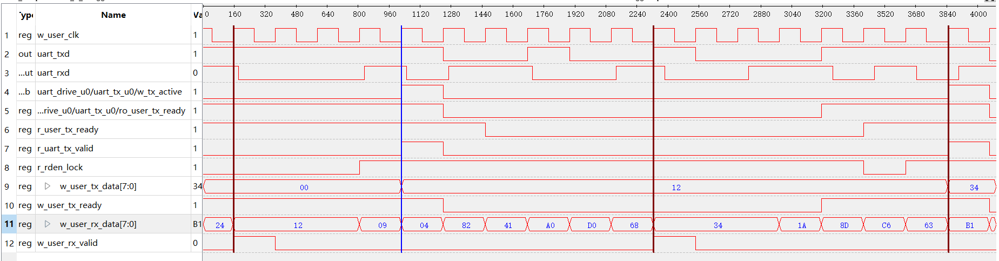  
## 至此UART通信验证成功!!
#### 带FIFO 8*512的  
Utilization Statistics    
#lut                      178   out of   4480    3.97%  
#bram                       1   out of     12    8.33%  
#### 不带FIFO的 
Utilization Statistics  
#lut                      116   out of   4480    2.59%  

>下面将UART通信模块和主机模块进行合并，串口通信助手模拟MCU通信发送报文    

# P8_9
将UART通信模块和主机模块进行合并完成，通过串口通信助手模拟MCU通信发送报文，观察收到的数据、DO和LED的现象  
数据完整测试test 01 23 45 67 89 ab cd ef fe dc ba 98 76 54 32  
报文实例：00 01 00 00 10 08 08 00 00 00 00 00 00 7E AA

|地址|ack|操作码|起始地址|数据位数|数据内容|报文功能|
|--|--|--|--|--|-- |-- |
|16位十进制|16位二进制|四位十进制|12位十六进制|8位十进制|64位二进制||
|00 02 |00 00| 1|0 00| 10| 00 00 00 00 00 00 7E E7|	对从机1写7EE7                |
|00 02 |00 00| 0|0 00| 10| 00 00 00 00 00 00 00 00|	对从机1从地址0读16位         |
|00 02 |00 00| 0|0 04| 08| 00 00 00 00 00 00 00 00|	对从机1从地址4读8位          |
|00 02 |00 00| 1|0 0c| 04| 00 00 00 00 00 00 00 0E|	改写从机1地址12后4位数据为E  |
|00 02 |00 00| 0|0 0c| 04| 00 00 00 00 00 00 00 00|	对从机1地址12读后4位         |
|00 00 |00 00| 2|0 00| 00| 00 00 00 00 00 00 00 00|	自动编号(主机编号默认为1)    |       
|00 02 |00 00| 1|2 00| 01| 00 00 00 00 00 00 00 10|	修改从机1设备号ID号为16      |
|00 02 |00 00| 0|0 40| 10| 00 00 00 00 00 00 00 00|	读从机1的低16位初值          |
|00 02 |00 00| 1|0 40| 10| 00 00 00 00 00 00 7E E7|	修改从机低17位初值为7EE7     |

00 02 00 00 00 00 10 00 00 00 00 00 00 00 00
00 02 00 00 10 00 10 00 00 00 00 00 00 E7 7E  
00 02 00 00 00 04 08 00 00 00 00 00 00 00 00  
00 02 00 00 10 0c 04 00 00 00 00 00 00 00 0E  
00 02 00 00 00 0c 04 00 00 00 00 00 00 00 00  
00 00 00 00 20 00 00 00 00 00 00 00 00 00 00  
00 02 00 00 12 00 01 00 00 00 00 00 00 00 10  
00 02 00 00 00 40 10 00 00 00 00 00 00 00 00  
00 02 00 00 10 40 10 00 00 00 00 00 00 E7 7E  
## 至此模拟上位机与主机通信验证成功!!
    
# P8_11 综合测试
先计算发一条报文从发送到接收完成所需要的时间，编写多条报文进行循环发送测试，检验数据准确率 baud=115200   
由示波器观察RX与TX的信号，模拟上位机向单个主机单个从机发送报文 完整收发时间= 3.14ms RX末与TX初间隔= 115us Uart收数据1.3ms Uart收数据1.72ms   
约定最少5ms发送一次报文 保存接收数据后用Matlab数据处理 验证数据正确性   
#### 待修复的小BUG &#x26a0;&#xfe0f;   
由于程序使用FIFO进行数据缓存，要求报文的发送报文的正确性完整性   
(不正确比如加上换行符0D超过15个byte或者少于15byte)    
否则会导致程序后续发送后收到数据皆为无效   
BUG修复&#x2705;:增加报文容错，报文长度不超过19个byte(可修改),可正常接收前15个byte，之后的数据丢弃，以保证FIFO为空，接收下一次报文   
### 测试A：PC端模拟MCU发送报文测试   
1、读写测试：写数据 --> 读数据 --> 修改数据 --> 读指定数据 &#x2705;  
(BUG修复&#x2705;) 写数据DO输出出现问题，DO输出应该是以APP层RAM128_1的值而不是报文的内容；  
                 原因：将报文内容输出给了DO模块  
                 解决方法：修改DO模块i_ast_subcode_data的来源为APP层RAM128_1的低64位。  
2、初始化测试：自动编号 --> 修改ID --> 读取初值  --> 修改初值 --> 复位后再读取初值  &#x2705;  
(BUG修复&#x2705;) 对初始值进行修改时无法写入；  
                 原因：i2c_top中对APP层数据捕获失败          
                 解决方法：对25M时钟的数据进行打拍延时至500K时钟足以捕获       
注意事项：自动编号给写入的地址为十六进制数据，改写的时候也是写十六进制数据进去，但是进行ID匹配时(前两个byte)是掩码数据  
例如 第3个从机ID的内部存储ID号=08，需要改为从机4的ID5，报文= 00 08 00 00 12 00 01 00 00 00 00 00 00 00 05   
     需要访问此设备，头部ID应该为 0001 0000  
     第1个从机ID的内部存储ID号=02，需要改为从机5的ID6，报文= 00 02 00 00 12 00 01 00 00 00 00 00 00 00 06   
     需要访问此设备，头部ID应该为 0010 0000  

3、测试稳定性：通过循环发送6条的报文，6条报文收到的报文皆已知。  
用Matlab对若干个收到的报文进行解析，若干条15byte报文以空格相连，需要先处理成单条进行验证收发功能正确性，  
报文的内容分别是：设备地址 16‘h0002(收发不改变)，ack 16‘h0000(经过一个设备向左移位补1)，  
操作码4‘h1(收发不改变，0为读1为写)，起始地址12‘h000(收发不改变)，数据位数8‘h10(收发不改变)，  
数据内容64'h0000000000007EE7 (写不变，读根据返回值变化)  
00 02 00 00 00 00 10 00 00 00 00 00 00 00 00  
00 02 00 00 10 00 10 00 00 00 00 00 00 E7 7E  
00 02 00 00 00 00 10 00 00 00 00 00 00 00 00  
00 02 00 00 00 04 08 00 00 00 00 00 00 00 00  
00 02 00 00 10 0C 04 00 00 00 00 00 00 00 07  
00 02 00 00 00 0C 04 00 00 00 00 00 00 00 00  
10ms发一次：总接收报文条数: 1064 匹配正确的报文条数: 1054 正确率: 99.06%  
20ms发一次：发byte34440 收34440总接收报文条数: 2296 匹配正确的报文条数: 2296 正确率: 100%  
1、示波器看发送周期并非串口助手定义发送周期？？  
原因：Windows 不是实时操作系统，后台任务、CPU 负载等可能导致定时器延迟  
2、上位机发送频率高的话收到的报文准确率会大幅度降低。&#x26a0;&#xfe0f;     
原因：发现串口助手发送频率过高时，收到的报文会比发送的少几条   
通过示波器观察发现在FPGA接收上位机报文时，出现有些相同的报文重复发、不同的报文连续发。   
导致收到报文存在收到相同报文、丢包的情况???    
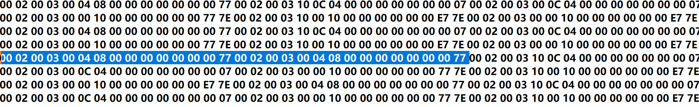  
00 02 00 03 00 04 08 00 00 00 00 00 00 00 77 收了两次   
分析：理论上上位机发送报文规定10ms的周期，则发送周期至少10ms以上(取决电脑CPU处理能力)，   
但是出现了重复发连续发的情况，可以排除上位机的问题，分析USB转TTL模块。   
USB 转串口芯片（如 CH340、CP2102）的延迟：部分廉价转换芯片可能存在缓冲或调度问题。   
操作系统串口驱动缓冲：某些驱动会合并短时间内的多次发送，导致间隔不均匀   
解决方法：更换USB转TTL模块，上位机5ms发送一次(实际上示波器观察发送周期为5~35ms不等)，收到的报文验证100%通过。  

修改 主频=25MHz(48M时钟可能偏差较大，影响不大) 修改波特率= 460800  分频系数 = 52.25    
​uart工作频率≈460815Hz 460K  2.17007us 收发一条报文需要750us左右 收发间隔为14~16us    
理论上可以达到1ms发送一次，但对定时器要求较高    
5ms发一次：总接收报文条数: 1081 匹配正确的报文条数: 1081 正确率: 100.00%   
5ms发一次：总接收报文条数: 1906 匹配正确的报文条数: 1772 正确率: 92.97% (原因是在1772条之后4条的接收出错，并且少收了第一条的回信)    
5ms发一次：总接收报文条数: 1748 匹配正确的报文条数: 854 正确率: 48.86% (原因是在854条之后4条的接收出错，并且少收了第一条的回信)   
问题：出现偶发性收报文出错   
分析：  
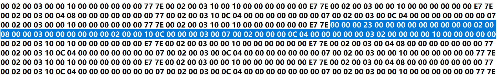   
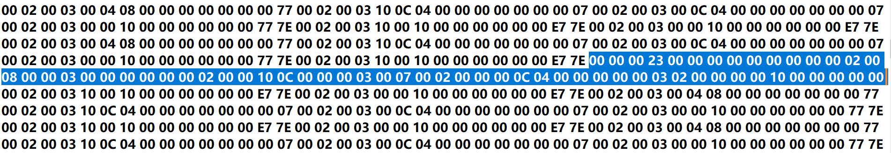   
在划线后面添加一条 00 02 00 03 00 00 10 00 00 00 00 00 00 77 7E  则后面报文对对齐   
错误报文：    
00 00 00 23 00 00 00 00 00 00 00 00 00 02 00   
08 00 00 03 00 00 00 00 00 00 02 00 00 10 0C   
00 00 00 03 00 07 00 02 00 00 00 0C 04 00 00   
00 00 00 03 02 00 00 00 00 10 00 00 00 00 00   

原因1：发现有时序警告如下图，数据路径延迟：1.11 ns 逻辑延迟：0.06 ns 线网延迟：1.05 ns 可能由于布线拥塞或长距离信号传输   
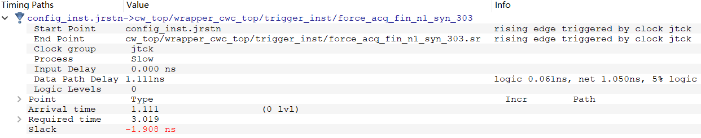   
解决方法：由于cw调试文件的资源占用较大，将cw调试文件移除，布局布线不会造成时序问题   
原因2：双绞线松动会导致收发乱码  (后续需要更换)
- (单片机)5ms发一次： 总接收报文条数: 1370 匹配正确的报文条数: 1370 正确率: 100.00%    
- (单片机)5ms发一次： 总接收报文条数: 1739 匹配正确的报文条数: 1739 正确率: 100.00% 
- (单片机)5ms发一次： 总接收报文条数: 2016 匹配正确的报文条数: 2016 正确率: 100.00% 
- (单片机)5ms发一次： 总接收报文条数: 2351 匹配正确的报文条数: 2351 正确率: 100.00%    

- (CH340)5ms发一次： 总接收报文条数: 1589 匹配正确的报文条数: 1589 正确率: 100.00%   
- (CH340)10ms发一次：总接收报文条数: 3892 匹配正确的报文条数: 3892 正确率: 100.00% 稳定  
>注意CH340转接 5ms发一次在多条报文还是会出现收到重复报文的问题  PC端发报文周期不稳定，需要换MCU再测试   
原因1、串口助手的发送周期依赖软件定时器（如 Sleep()、QTimer），但普通 OS 的定时器精度通常 ≥ 1ms（Windows 默认 15.6ms 调度周期）。    
即使设置 5ms，实际间隔可能波动到 5~20ms（受后台进程、CPU 负载影响）。    
原因2、USB 协议本身有 帧间隔（1ms@Full Speed），且数据需打包成 USB 协议包，引入额外延迟。  
即使波特率足够高（如 1Mbps），USB 芯片的 内部缓冲机制 也可能合并短时间内的多次发送，导致间隔不均匀。  
解决办法：改用 实时操作系统（RTOS） 或 单片机硬件定时器触发发送（如 STM32 的硬件 UART + DMA）。  

>补充： 通过MATLAB脚本控制串口发送报文并接收校验，打印结果如下
===== 测试结果 =====  
报文条数: 500/500  成功率: 100.0% (500/500)  平均耗时: 6.1ms   最大耗时: 30.2ms(第一次)  最小耗时: 4.8ms     
===== 测试结果 =====  
报文条数: 2500/2500 成功率: 100.0% (2500/2500) 平均耗时: 6.2ms 最大耗时: 33.0ms  最小耗时: 4.2ms  
===== 测试结果 =====  
报文条数: 5000/5000 成功率: 100.0% (5000/5000) 平均耗时: 6.6ms 最大耗时: 32.6ms  最小耗时: 4.1ms  
===== 测试结果 =====  
报文条数: 6000/6000 成功率: 100.0% (6000/6000) 平均耗时: 6.6ms 最大耗时: 33.4ms  最小耗时: 4.1ms  
===== 测试结果 =====   
报文条数: 60000/60000 成功率: 100.0% (60000/60000) 平均耗时: 6.6ms 最大耗时: 120.4ms  最小耗时: 4.1ms   
===== 测试结果 =====  
报文条数: 60000/60000 成功率: 100.0% (60000/60000) 平均耗时: 6.3ms 最大耗时: 36.7ms 最小耗时: 3.9ms  
通过示波器观察发送周期在4~7ms 板间通信周期15us左右  
### 测试B： 联合MCU测试   
没有MCU，在从机开辟一块独立的报文发送程序，发给主机，主机AST通信发给从机，主机收到从机的回信后将回信报文发给PC端进行检验。  
为了检测系统稳定性，可以在程序开始是取一段报文进行检验，待程序运行一段时间后随机取一段进行检验。    
#### 手动随机取报文进行校验
根据发送周期=1.08ms 可计算1s可完成近1000次收发。1小时近360万次发送   
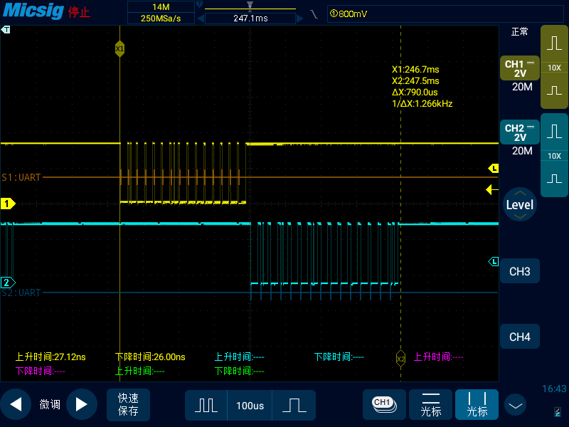  
  
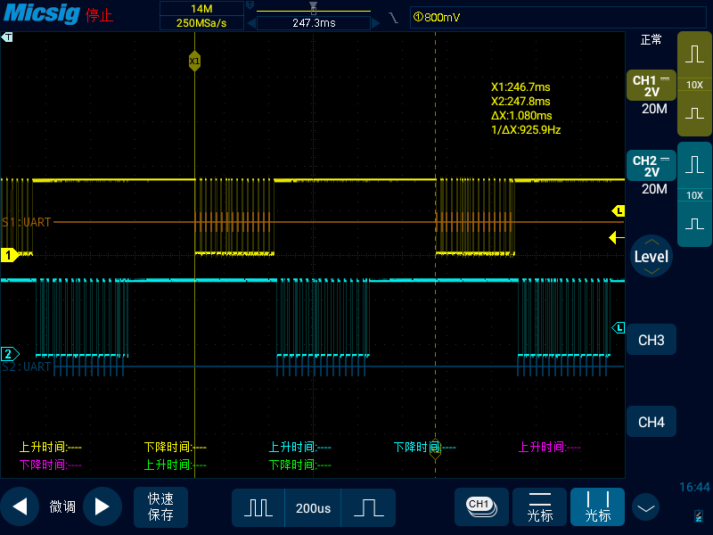   
通过示波器观察发送周期在1.08ms 板间通信周期15us左右   
1、总接收报文条数: 26181 匹配正确的报文条数: 26181 正确率: 100.00%    
2、总接收报文条数: 3790  匹配正确的报文条数: 3790  正确率: 100.00%  
3、总接收报文条数: 33574 匹配正确的报文条数: 33574 正确率: 100.00%  
间隔1小时后取一段检测：  
4、总接收报文条数: 10985 匹配正确的报文条数: 10985 正确率: 100.00%  
5、总接收报文条数: 18597 匹配正确的报文条数: 18597 正确率: 100.00%  
6、总接收报文条数: 38756 匹配正确的报文条数: 38756 正确率: 100.00%  
#### 自定义时间取报文进行校验
PC端自定义时间定时接收10s的数据进行校验，校验完的结果见 EF2_Proj\matlab_test\test_RX_RT_results   
本实验参数配置如下  
serialPort = 'COM8';          % 串口号  
baudRate = 460800;            % 波特率  
RECEIVE_INTERVAL = 1 * 60;    % 接收间隔时间(秒)  
RECEIVE_DURATION = 10;        % 每次接收持续时间(秒)  
EXPECTED_PACKETS = 10000;     % 期望接收的完整报文数量(条)  
PACKET_SIZE = 15;             % 每条报文字节数  
理论上接收10s的数据应该是10000条报文，由于实际发送周期为1.08ms，实际接收完10000条需要10.8s  
所以10s接收的报文在10*10000/10.8 9256条左右  

进一步的，如果要测试24*7小时的时间，计划将PC端接收数据校验放在主机进行，  
即主机返回给PC端的数据直接回环给主机的校验模块(主机的一片独立模块)    
校验模块说明：接收主机的回信，并按顺序进行校验，如果校验出错会中断并计数+1，之后返回空闲态重新匹配第一条报文。    
实际测试时收发异常原因：  
1、双绞线松动导致收信不完整   
2、电源电压不稳定导致  
3、PC端接收非实时接收，具有延时导致报文不完整 并非硬件问题  
matlab验证出现收发异常原因:   
例1：  
报文02713: 00 02 00 03 10 00 10 00 00 00 00 00 02 00 03 第1、2两条不完整，直接跳到第三条  
报文02714: 00 00 04 00 00 00 00 00 00 00 0E 00 02 00 03  
报文02715: 10 0C 04 00 00 00 00 00 00 00 07 00 02 00 03  
例2：  
报文03882: 00 02 00 03|00 00 00 00 00 00 07 00 02 00 03   
报文03883: 10 00 10 00 00 00 00 00 00 E7 7E 00 02 00 03   
报文03884: 00 00 10 00 00 00 00 00 00 E7 7E 00 02 00 03   
例3 第49次接收出错：  
报文02403: 00 02 00 03 00 00 04 00 00 00 00 00 00 00 0E    
报文02404: 00 02 00 03 10|00 02 00 03 10 00 04 00 00 00    
报文02405: 00 00 00 00 07 00 02 00 03 00 0C 04 00 00 00    
报文02406: 00 00 00 00 07 00 02 00 03 10 00 10 00 00 00    

经过12h运行，检测到了六次报文接收有误，完全可以判断为电压不稳定造成  
改用稳定的电压源进行测试12h未检测到错误，但电源受到外界干扰或者传输线受到干扰还是会导致信号接收有误  
波特率x2后用示波器观察会有报文出错
-----------------------------------综合测试结束 -----------------------------------   
后续：Uart通信的LED状态的完善&#x2705;   
回顾前面的测试     
|状态|主机|从机|   
|--|:--|:--| 
|0.5s闪烁|MCU警报|EEPROM警报/DO输出报错|  
|2s闪烁|通讯模块报错(后模块未连接/后模块通信失败)|通讯模块报错(前模块未连接)|  
|常亮|正常运行|正常运行|  

# p8_15  
(LED显示BUG修复&#x2705;): 增加计数器，分别对不同灯状态进行区别；  
主机的LED状态的完善&#x2705;  主机上电后0.5s闪烁表示上位机没有发送有效数据过来，   
如果主机收到MCU的报文则开始2ms闪烁，直到收到后面从机的回信则常亮表示正常运行，复位的话重新0.5ms闪烁回到初始态。  
从机的LED状态 ： 从机上电后1ms闪烁，EEPROM初始化成功(正常成功初始化很快，看不到1ms闪烁现象)开始2ms闪烁，  
等待接收前一个模块的报文，如果成功接收，会开始0.5ms闪烁，如果DO输出(一般是正常输出)正常则常亮    
## 至此LED模块设计并验证完成!!   

# P8_16 
检查物理资源使用率，对代码进行优化，删去多余部分(综合保留的注释)， 主机部分资源使用变化不大,从机物理资源由79.5% 减小至75.5%。  
# P8_18
ADC采集实验(CLK = 500K)，改变寄存器的值，观察采集信号的变化   
三阶：9.12ms 采样时间为间隔2.5ms     
改三阶滤波为一阶滤波，初始化完成至第一个数据采集时间为2.16ms，后续采样率为1.6KHz，采样时间为间隔625us   
该PGA增益为x1、x2，采集的ADC数据幅值为实际电压的2倍或4倍。  
# P8_19  
关于24位 ADC采集滤波算法  
HCT6931采样率：fs_max = 6.4K  T_min = 156us  

1、均值滤波：Fs_max = fs_max/N, N为采样数 原理：对采样8个数据求均值输出     
2、一阶低通滤波：       y(n) = q*x(n) + (1-q)*y(n-1)  q = 0.5 (根据效果进行调整)  
3、均方根去噪声：       x(t) = sqrt(sum(x(t)^2)/n)   
4、传统卡尔曼滤波算法：   
   

# P9_1  
### ADC HCT3914数据采集
通信步骤：
写寄存器指令 01 + 配置寄存器地址[4:0] + 0
读寄存器指令 01 + 配置寄存器地址[4:0] + 1

#### 初始化MCP3914
对以下寄存器进行读取，并写寄存器配置，再次读取验证是否写入  
1、Δ−Σ 调制器输出(MOD寄存器)：  
   默认Code：00 33 33 00  
   操作码：51 读 50 写  
2、相位寄存器0 (PHASE0)：如果需要，设置相位延迟。  
   默认Code：00 00 00  
   操作码：53 读 52 写   
3、相位寄存器1 (PHASE1)：如果需要，设置相位延迟。   
   默认Code：00 00 00  
   操作码：55 读 54 写  
4、增益寄存器 (GAIN): 3*8 通道n的PGA设置位。地址：0B   
   默认Code：00 00 00  
   操作码：57 读 56 写  
5、状态通信寄存器 (STATCOM)：设置数据格式（24/32位）、校验和等。地址：0C   
   默认Code 1010 1001 0000 0000 0000 0011     A9 00 03  
   操作码：59 读 58 写  
6、配置寄存器0(CONFIG0)：设置OSR、预分频器等，决定采样率。地址：0D   
   默认Code 0011 1000 0110 0000 0101 0000     38 60 50  
   操作码：5B 读 5A 写  
7、配置寄存器1(CONFIG1)：设置 PGA 增益、通道使能、复位等。地址：0E   
   默认Code 0000 0000 0000 0000 0100 0000     00 00 40  
   操作码：5D 读 5C 写  
8、LOCK寄存器：可改写配置寄存器,可以在修改完其他配置寄存器后修改进行锁住，以保证配置不被修改地址：1F  
   默认Code：A5 00 00  
   操作码：7F 读 7E 写  
初始化顺序： 
读LCOK 是否为默认code 是则继续下面配置，不是则改为默认code再继续  
修改STATUSCOM的为24'hB90000  
修改CONF0为24'h38_20_50  
修改CONF1为24'h0  
GAIN增益设置为1 ：24'b0  4则为24'h49_24_92  

#### 阻值计算公式  
AD = ADmax*G*1.5*(CH0P-CH0N)/(REFP-REFN)   
CH0P-CH0N =(REFP-REFN)*AD/(ADmax*G*1.5) = R1*Ir  
R1 =(CH0P-CH0N)/Ir  
   =Vref*AD/(ADmax*G*1.5)/Ir  
其中  
Ir = 500uA = 0.0005A  
Vref = 1.2V (-0.1V)   
Admax = 8388608  
G = 1   
更新频率：MCLK/(4*PRE*OSR)  
PRE = 1    00    
OSR = 64   001   
T = 25us   40Khz  

#### ADC读取数据
读数据指令 01 + 数据寄存器地址[4:0] + 1  
8'h41 从通道00开始读 对应于板子的A16 B16  
根据DR下降沿信号拉低CS信号进行读数据指令发送.DR拉低需25ns内启动SCLK，发送读数据指令  
关于DR信号是否能捕获:DMCLK = 4M*1/(4*[pre1:pre0])=4/(4*8)=125K,DR最小低电平持续时间为0.5*8us=4us  

问题：无法正确读取配置寄存器，只有LOCK寄存器读取正确      
经过检查时序与外围电路没有问题，换一个芯片后可以正常读写寄存器；后续完成ADC数据采集    
原因：ADC电源接地处接FPGA板的地，导致读写出错   
# P9_3  
经过寄存器配置，完成了数据采集，但是采集数据不对，可能寄存器配置有问题，后续完善寄存器配置与连续多通道采样，并且提高采样率。  
# P9_4  
排查外围电路短接，采集数据正常。
1、八通道采集  
配置OSR和BOOST控制DR更新时间为25us。 
配置SCLK = 10Mhz 读写1byte大约需要0.5us   
配置READ<1:0> = 10地址计数器自动递增，按寄存器类型进行循环，8通道循环读  

2、单通道采集  
配置READ<1:0> = 00；地址不递增，连续读取同一寄存器地址   
不过判断数据更新需要读取STATUSCOM寄存器低八位(对应八个通道)是否为0，对应通道为0则就绪可读   
⚠️注意：SCLK速率的降低同时需要修改DR相关配置，增加DR就绪周期，以保证读数据期间不发送(发送对ADC无效)

# P9_5 
对于八通道采集数据做滤波需要考虑：
1、数据输出速率(数据需要多久更新一次)
2、SCLK最大多少可以保证采集数据 
3、主频是否支持在下一次采集数据到来前完成滤波算法(完成滤波所需要的时间)

### 一阶低通滤波：
   y(n) = q*x(n) + (1-q)*y(n-1)  q = 0.5 (根据效果进行调整) 
优点
适用于低频信号滤波：一阶滞后滤波能够有效抑制高频噪声，特别适合对温度、湿度、压力等低频信号进行平滑处理。  
占用资源少：一阶滞后滤波仅需要保存一个历史滤波值，内存占用极小，非常适合资源有限的嵌入式系统。  
平滑度和灵敏度可调：通过调整权重系数 α，可以在平滑度和系统的灵敏度之间取得平衡。  
例如，在需要更平滑的输出时，可以选择较小的 α 值；而在需要快速响应时，选择较大的 α 值。   
缺点   
对突变信号反应慢：由于是递推滤波方式，系统在面对信号突变时响应较慢，不能快速捕捉到信号的剧烈变化。  
滤波效果依赖于 α 的选择：如果 α 的取值不合理，可能会导致滤波效果不佳。例如，α 值过大可能导致滤波效果不足，而 α 值过小会导致信号滞后。

